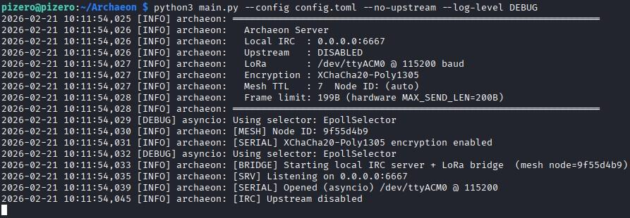

# Archaeon

A bridge that connects IRC to LoRa mesh network for off-grid, low-bandwidth chat. This setup allows users to chat in areas without power and with limited internet, using long-range radio signals.

```
Local IRC Client ─── Embedded IRC Server ─── LoRa Mesh
                             │
                     Upstream IRC Network
                     (e.g. irc.libera.chat)
```

Nodes relay packets on behalf of each other, so clients out of direct radio range can still communicate through intermediate nodes.

## Supported LoRa module(s) (more will be added):

- LilyGo T3 V1.6.1 868MHz ✅

## Screenshot



## Features

* **IRC server** — local clients connect with any standard IRC client ([TheLounge](https://thelounge.chat/) is recommended); no external IRC server needed
* **LoRa mesh** — flooding/reverse-path routing protocol enables multi-hop delivery across nodes that can't directly reach each other
* **Wi-Fi AP** — each node broadcasts its own open Wi-Fi network (named after its node ID, e.g. `node_a3f9c1`) so nearby devices can connect directly without any existing infrastructure
* **IRC relay** — optionally bridges to an IRC network (defaults to irc.libera.chat). The upstream connection may be routed through a SOCKS5 proxy (e.g. a local Tor SOCKS5 listener) for additional privacy.
* **SASL auth** — optional SASL PLAIN login for upstream IRC connections; recommended for networks that require account-based authentication
* **XChaCha20-Poly1305 encryption** — optional authenticated encryption for all LoRa frames; routing headers are plaintext so intermediate nodes can forward without decrypting; payload is fully encrypted
* **Smart compression** — payloads are compressed using the best available algorithm (LZ4 if installed, otherwise zlib) and encoded with Base85 for maximum wire efficiency; falls back gracefully to raw text when compression yields no benefit
* **TLS support** — upstream IRC connections use TLS by default

## Requirements

```
Python 3.11+   (or Python 3.9+ with `pip install tomli`)
Tor            (optional, for connecting to upstream IRC network anonymously)
pyserial       (for LoRa serial communication)
cryptography   (required for encryption)
serial-asyncio (for async serial I/O)
lz4            (for faster/better compression)
```

Install dependencies:

```bash
pip install -r requirements.txt
```

## Quick Start

Run with defaults (connects to upstream `irc.libera.chat`, LoRa on `/dev/ttyACM0`):

```bash
python main.py --config config.toml
```

Run without upstream IRC (local + LoRa mesh only):

```bash
python main.py --config config.toml --no-upstream
```

## Wi-Fi Access Point

Each node automatically starts an open Wi-Fi access point on boot. The SSID is derived from the node's persistent random ID (e.g. `node_a3f9c1`) and is displayed on the OLED screen. The node ID — and therefore the SSID — is generated once using the hardware RNG and stored in non-volatile storage, so it remains the same across reboots and firmware reflashes.

The ESP32 acts purely as a radio bridge — the IRC server runs on the host machine connected to it via serial. To use the access point, the host machine must also connect to the node's Wi-Fi network, which makes it reachable to other devices on that same network. IRC clients can then connect to the host's IP address on port `6667` as normal. No password is required to join the Wi-Fi network. This makes it possible to chat over LoRa with nothing but a Pi Zero 2W running the bridge and a phone as the IRC client — no router, no infrastructure.

## Configuration

Example `config.toml`:

```toml
[local]
host        = "0.0.0.0"
port        = 6667
server_name = "archaeon"
motd        = "Archaeon – messages are bridged between IRC-LoRa."
# password    = ""   # require password for local clients

[upstream]
enabled     = true
max_retries = 0   # 0 = retry forever

[irc]
server   = "irc.libera.chat"
port     = 6697
nick     = "LoRa"
tls      = true
# password      = ""
# sasl_username = "" # SASL PLAIN account name
# sasl_password = "" # SASL PLAIN password

tor       = false # route upstream IRC through Tor if true
tor_host  = "127.0.0.1"
tor_port  = 9050

[serial]
enabled = true
device  = "/dev/ttyACM0"
baud    = 115200

[tuning]
collision_avoidance_ms = 1000
send_delay_ms          = 3000
send_jitter_ms         = 500
send_retries           = 10
gossip_suppress_k      = 2     # neighbours that must be heard forwarding a broadcast before suppressing our own rebroadcast
adaptive_backoff       = true  # scale TX delay with measured channel utilisation

[encryption]
key = ""   # 64-char hex string or "@/path/to/keyfile"

[mesh]
# node_id   = "" # auto-generated if omitted
# ttl       = 7
```

### SASL Authentication

SASL PLAIN is the standard mechanism used by networks like Libera.Chat and OFTC for account-based login. It is strongly recommended over `password` (NickServ PASS) when the server supports it, as SASL authenticates before channel join rather than through a NickServ message after registration.

SASL requires TLS (keep `tls = true` and `port = 6697`) to avoid sending credentials in plaintext.

The bridge will abort the connection and retry if SASL credentials are configured but authentication fails, rather than continuing unidentified.

### CLI Options

| Flag                       | Default           | Description                                                            |
| -------------------------- | ----------------- | ---------------------------------------------------------------------- |
| `--local-host`             | `0.0.0.0`         | Bind address for embedded IRC server                                   |
| `--local-port`             | `6667`            | Port for embedded IRC server                                           |
| `--local-server-name`      | `archaeon`        | IRC server name shown to clients                                       |
| `--local-password`         | —                 | Optional password for local IRC clients                                |
| `--no-upstream`            | —                 | Disable upstream IRC relay                                             |
| `--upstream-max-retries`   | `0`               | Max reconnect attempts (0 = infinite)                                  |
| `--irc-server`             | `irc.libera.chat` | Upstream IRC server                                                    |
| `--irc-port`               | `6697`            | Upstream IRC port                                                      |
| `--irc-nick`               | `LoRa`            | Nick used on upstream IRC                                              |
| `--irc-password`           | —                 | Upstream IRC server password                                           |
| `--irc-sasl-username`      | —                 | SASL PLAIN account name for upstream IRC                               |
| `--irc-sasl-password`      | —                 | SASL PLAIN password for upstream IRC                                   |
| `--no-irc-tls`             | —                 | Disable TLS for upstream connection                                    |
| `--no-serial`              | —                 | Disable LoRa serial entirely (IRC-only mode)                           |
| `--serial-device`          | `/dev/ttyACM0`    | LoRa serial port                                                       |
| `--serial-baud`            | `115200`          | Serial baud rate                                                       |
| `--collision-avoidance-ms` | `1000`            | Minimum idle time after last RX before TX (ms)                         |
| `--send-delay-ms`          | `3000`            | Minimum gap between consecutive transmissions (ms)                     |
| `--send-jitter-ms`         | `500`             | Random jitter added on top of send delay (ms)                          |
| `--send-retries`           | `2`               | Per-chunk retransmit attempts before giving up                         |
| `--gossip-suppress-k`      | `2`               | Neighbours heard forwarding a broadcast before suppressing our own copy |
| `--no-adaptive-backoff`    | —                 | Disable channel-utilisation-based TX back-off                          |
| `--encryption-key`         | —                 | 64-char hex key or `@/path/to/file`                                    |
| `--mesh-node-id`           | —                 | Fixed 8-char hex node ID (auto-generated if omitted)                   |
| `--mesh-ttl`               | `7`               | Max hop count for mesh packets                                         |
| `--log-level`              | `INFO`            | Log verbosity: `DEBUG`, `INFO`, `WARNING`, `ERROR`                     |
| `--config`                 | —                 | Path to TOML config file                                               |
| `--tor`                    | —                 | Route upstream IRC through a SOCKS5 proxy (e.g. local Tor)            |
| `--tor-host`               | `127.0.0.1`       | SOCKS5 proxy host when `--tor` is used                                 |
| `--tor-port`               | `9050`            | SOCKS5 proxy port when `--tor` is used                                 |

---

## Mesh Networking

The bridge implements a gossip-based probabilistic flooding protocol on top of the existing serial JSON framing. Every bridge node participates in the mesh — it forwards packets on behalf of other nodes, extending the effective radio range beyond any single node's line-of-sight — but intelligently suppresses redundant retransmissions to keep the channel quiet in dense deployments.

### How it works

Each node has a unique 8-character hex **node ID** (auto-generated at startup, or set with `--mesh-node-id`). Every outgoing message is wrapped in a mesh envelope:

```json
{"m": {"src": "a1b2c3d4", "dst": "*", "id": "a1b2c3d4:f09e",
       "ttl": 7, "hops": 0, "via": "a1b2c3d4", "p": "<payload>"}}
```

When a node receives a mesh packet it:

1. **Updates the neighbour table** — records the sending node (`via`) with the current timestamp, and updates per-neighbour RSSI and SNR estimates using an exponential moving average (if the firmware emits signal annotations on the serial line).
2. **Learns a reverse route** — records that to reach `src`, forward toward the neighbour (`via`) who just sent this packet, weighted by link quality.
3. **Deduplicates** — drops the packet if its ID has been seen within the last 60 seconds, preventing forwarding loops.
4. **Delivers locally** — passes the payload up to the IRC bridge if `dst` is `"*"` (broadcast) or matches this node's own ID.
5. **Forwards** — decides whether and how to rebroadcast, with `ttl` decremented and `hops` incremented:

   * **Broadcast (`dst = "*"`):** uses gossip suppression (see below) rather than unconditional flooding.
   * **Unicast to a known destination:** forwards only toward the learned next hop; no rebroadcast to unrelated nodes.
   * **Unicast to an unknown destination:** floods until a route is learned, then switches to directed forwarding.
   * **Already forwarded:** a separate forwarded-packet cache ensures a node never emits the same packet ID twice, even if it arrives via multiple neighbours.

Routes expire after 5 minutes and are periodically purged. The routing table and neighbour table are both logged alongside standard stats.

### Gossip suppression

Naive flooding causes O(n) redundant transmissions per message in a dense network. Archaeon uses a **Gossip-3 variant** to suppress most of them:

* When a node overhears a neighbour forwarding a broadcast, it records that neighbour as a forwarder for that packet ID.
* If **0** neighbours have been heard forwarding the packet, this node always forwards (it may be the only one who heard the source).
* If **≥ `gossip_suppress_k`** neighbours (default: 2) have already been heard forwarding it, this node skips its own rebroadcast entirely.
* In between, the forward probability ramps down linearly: `p = 1 − k / gossip_suppress_k`.

The result is that a 10-node mesh generates roughly the same number of total transmissions per message as a 3-node mesh, while still guaranteeing delivery across sparse or split topologies where few forwarders are present.

### Link-quality routing

Each received frame updates a per-neighbour **link-quality score** (0.0–1.0) computed from the RSSI and SNR exponential moving averages:

```
score = 0.6 × normalised_RSSI + 0.4 × normalised_SNR
```

Neighbours that have not been heard for more than 120 seconds are marked stale and pruned. The `neighbor_summary()` diagnostic method (and `--log-level DEBUG`) shows the full neighbour table including scores, raw RSSI/SNR, receive counts, and age.

For unicast traffic the routing table uses this link quality to prefer paths through high-score neighbours when multiple routes to the same destination exist.

### Topology example

```
[Node A] <──────────────────────────> [Node B]
                                            │
                                       (out of range of A)
                                            │
                                       [Node C]
```

Node A can reach Node C through Node B. Node B automatically forwards packets in both directions without any configuration. If a fourth node, D, is within range of both A and B, gossip suppression will cause either A or B (but not both) to forward each broadcast — cutting channel occupancy roughly in half compared to the old flooding behaviour.

### Tuning TTL and gossip

The default TTL of 7 supports networks up to 7 hops deep. For a small 3-node network you can set `--mesh-ttl 3` to reduce unnecessary rebroadcasts. For larger or sparser networks, increase it.

`gossip_suppress_k` controls the trade-off between redundancy and reliability. Increase it (e.g. `3` or `4`) in very sparse or unreliable RF environments where you want more redundant copies in the air. Lower it (e.g. `1`) in dense, high-node-count deployments where channel congestion is the primary concern.

## Chunked Transmission & Reliability

Messages that exceed the LoRa frame size limit are automatically split into numbered chunks and reassembled at the receiver. The chunking layer provides the following reliability guarantees:

### Sender behaviour

* All chunks are pre-loaded into the TX cache before the first byte is sent. This ensures that NACKs for early chunks that arrive while later chunks are still being transmitted always find a live cache entry and trigger a retransmit — even mid-burst.
* **All chunks are always attempted**, even if one fails. The receiver sees the full picture of what was sent and can NACK individual missing gaps. Chunks are retried up to `send_retries` times before being marked as permanently failed.
* TX cache entries are timestamped at burst-end (not enqueue time), so `TX_DONE_TTL` is measured from the last byte sent. The sender remains responsive to NACKs for the full TTL window after transmission completes.
* A successful NACK response refreshes the TTL on **all** cached chunks for that message, not just the retransmitted one. This keeps the entire session alive while the receiver works through gaps one at a time.

### Receiver behaviour

* Each chunk is CRC32-verified on arrival. A mismatch or base64 decode failure triggers an immediate NACK for that specific chunk — it does not wait for the proactive NACK loop.
* The reassembly session tracks `first_chunk_ts` (set once at session creation) independently of `ts` (reset on every received chunk). Proactive NACKs are triggered based on `first_chunk_ts`, so a missing early chunk in an otherwise active burst is still NACKed after the NACK interval even if later chunks keep arriving.
* Completed messages are recorded in an `rx_done` cache. Duplicate retransmits of already-assembled chunks are silently dropped.

### NACK coalescing

All missing chunks for a single message are reported in **one NACK frame** rather than one frame per chunk:

```json
{"nack": {"id": "a1b2c3d4", "ii": [2, 5, 7], "src": "a1b2c3d4"}}
```

NACKs are **fire-and-forget**: they are enqueued as background tasks and do not block the read loop while waiting for the half-duplex channel to clear. An additional randomised **jitter of up to 800 ms** is applied before transmitting each NACK to spread competing NACKs from multiple nodes apart.

### Half-duplex channel

LoRa is a half-duplex medium. All transmissions — data and NACKs alike — enforce two timing rules before keying up:

1. **RX quiet-time**: wait until the channel has been idle for at least `collision_avoidance_ms` after the last received byte. The RX timestamp is updated on every received chunk, so the quiet-time window extends correctly throughout a multi-chunk burst.
2. **TX inter-frame gap**: wait until at least `send_delay_ms` has elapsed since this node's own last transmission.
3. **Adaptive back-off** (if enabled): if the estimated channel busy fraction exceeds 40 %, an additional scaled random delay is inserted proportional to busyness. This automatically throttles transmissions as node count or traffic density increases.

## Encryption

XChaCha20-Poly1305 authenticated encryption is supported. All nodes on the LoRa network must share the same 32-byte key.

Generate a key:

```bash
python3 -c "import os; print(os.urandom(32).hex())"
```

The mesh routing headers (`src`, `dst`, `ttl`, `hops`, `via`) are transmitted in plaintext so that intermediate nodes can make forwarding decisions without needing to decrypt. Only the message payload (`p`) is encrypted. Frames received with a non-matching key are silently dropped.

## Wire Format

Frames are newline-terminated JSON sent over serial.

**Mesh packet:**

```json
{"m": {"src": "a1b2c3d4", "dst": "*", "id": "a1b2c3d4:f09e",
       "ttl": 7, "hops": 0, "via": "a1b2c3d4", "p": "<payload>"}}
```

**Chunked mesh frame (one JSON object per chunk):**

```json
{"k": {"i": 1, "n": 3, "id": "a1b2c3d4", "crc": 3735928559, "d": "<base64>",
       "mh": {"s": "a1b2c3d4", "d": "*", "i": "a1b2c3d4:f09e", "t": 7, "h": 0, "v": "a1b2c3d4"}}}
```

**NACK (request retransmit of one or more missing chunks):**

```json
{"nack": {"id": "a1b2c3d4", "ii": [2, 5, 7], "src": "a1b2c3d4"}}
```

The `ii` field is a list of all missing chunk indices for this message, reported in a single frame. The legacy single-index field `"i"` is still accepted from older nodes for backward compatibility.

The `src` field identifies the node that originally transmitted the chunked message; only that node responds. Nodes that overhear a NACK addressed to a different `src` ignore it immediately. `src` may be omitted for NACKs triggered by corrupt frames where the originator cannot be determined.

Payloads (`p` field) may be prefixed:

* `B:` — compressed (zlib or LZ4) and Base85-encoded; a single tag byte inside the decoded data identifies the algorithm (`Z` = zlib, `L` = LZ4, `R` = uncompressed raw)
* `E:` — XChaCha20-Poly1305 encrypted (24-byte nonce prepended), Base64-encoded; the inner content may itself carry a `B:` prefix
* `Z:` — legacy zlib-compressed, Base64-encoded (accepted from older nodes for backward compatibility)

The bridge always emits the most compact encoding it can produce and falls back to raw plaintext when no encoding reduces size. Nodes running older firmware that emit `Z:` frames are decoded transparently.

## Message Routing

Every message is tagged with an 5-character hex **nonce** appended to the text: `message text [a3f9c]`. The nonce travels with the message untouched through every hop — IRC wire, LoRa payload, and local delivery — and is used by each bridge to detect and drop echoes of its own outgoing messages. IRC clients will see the nonce suffix in their chat window.

When a local IRC user sends a message to a channel, the bridge:

1. Forwards it (with nonce) to the same channel on the upstream IRC server (if enabled and joined)
2. Transmits it (with nonce) over LoRa as a mesh broadcast: `#channel|nick: message [nonce]`

When a LoRa mesh packet arrives addressed to this node or broadcast:

1. It is delivered to matching active local IRC channels
2. If no local clients are connected, it is forwarded upstream (or queued until joined)

When an upstream IRC message arrives:

1. It is relayed to local IRC clients on the same channel
2. It is transmitted over LoRa as a mesh broadcast

In all cases, intermediate mesh nodes forward the packet even if they have no local IRC clients connected. Forwarding decisions now account for link quality and gossip state so intermediate nodes choose the most efficient path and avoid saturating the channel.

## Diagnostics

Three summary methods are available (also emitted periodically at `INFO` level):

* `routing_table_summary()` — known routes, next hops, hop counts, and age
* `neighbor_summary()` — per-neighbour RSSI EMA, SNR EMA, composite score, receive count, age, and liveness status
* `reassembly_summary()` — active reassembly sessions with chunk progress, age, and missing indices

The stats counter dict (accessible via `stats()`) now includes:

| Counter              | Meaning                                                          |
| -------------------- | ---------------------------------------------------------------- |
| `gossip_suppressed`  | Broadcasts skipped because enough neighbours already forwarded   |
| `nacks_coalesced`    | Extra NACK frames saved by batching indices into one frame       |
| `unicast_forwarded`  | Unicast packets forwarded toward a known next hop                |
| `bcast_forwarded`    | Broadcast packets forwarded after gossip check                   |
| `adaptive_backoffs`  | TX delays added due to high channel utilisation                  |

## Compatibility

The LoRa serial module should echo JSON frames over UART. Any LoRa modem that passes through newline-delimited data works. The bridge has been tested with the LilyGO T3 868MHz (TTGO LoRa32) — Arduino firmware (`.ino`) for the T3 is included in this repository.

If the connected firmware emits RSSI and SNR annotations alongside received frames (e.g. `+RSSI=-85,SNR=6.5`), the bridge parses them automatically to populate the link-quality neighbour table. Firmware that does not emit these annotations is fully supported; link-quality scores are simply initialised to sensible defaults and improve as traffic is observed.

## License

Distributed under the MIT License. See `LICENSE` for more information.